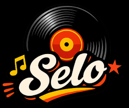
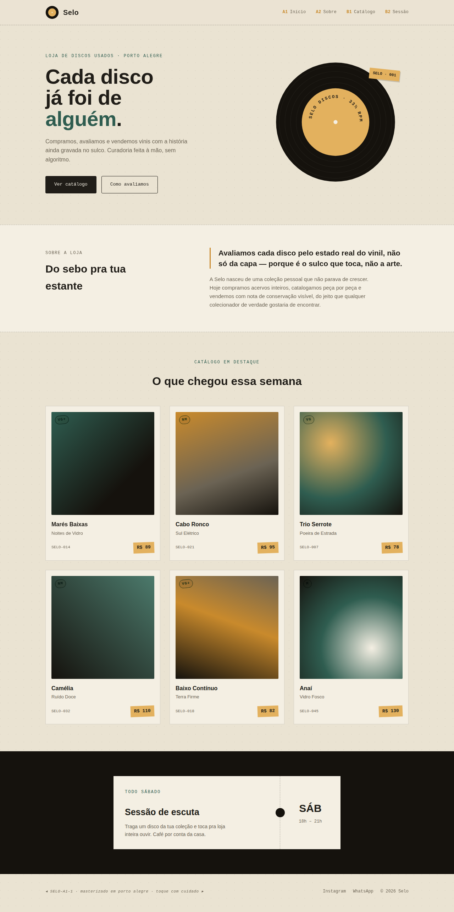
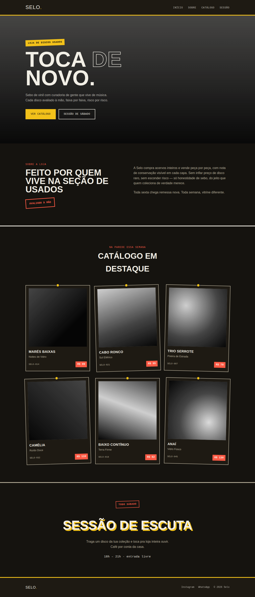
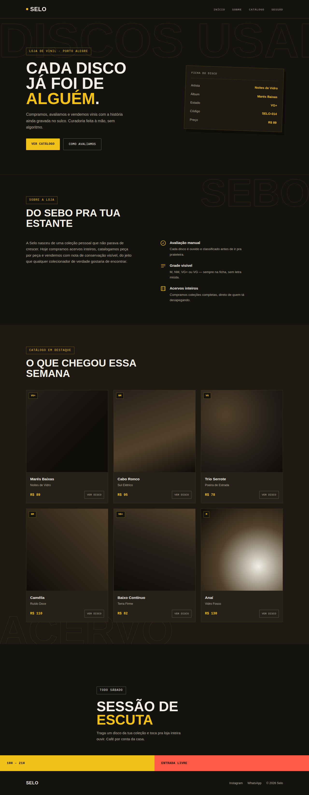

# Trabalho prático — Landing page com React + Tailwind

## O contexto

Vocês receberam um novo cliente. Ele já tem uma marca definida — nome, paleta de cores, tipografia — e passou um briefing com o conteúdo que quer no site. O trabalho de vocês não é *inventar* uma identidade visual do zero, é **traduzir uma especificação de cliente em código**, do jeito que acontece numa agência ou num freela de verdade.

Usem tudo que vimos no material da cafeteria **Grão**: componentização, props, `@theme` do Tailwind, separação de dados e apresentação, responsividade. Não é pra aprender nada novo — é pra aplicar sozinhos, sem o passo a passo do lado.

**Tempo estimado:** 3 a 4 horas.

---

## O cliente: Selo

**Selo** é uma loja de discos de vinil (novos e usados), com um espaço físico onde também rola sessão de escuta aos sábados. Público jovem, interessado em música, design gráfico e cultura pop. O tom da marca é **direto, gráfico, um pouco irreverente** — nada de cafeteria aconchegante. Pensem em capa de disco, não em vitrine de padaria.

### Identidade visual (obrigatória — não é pra reinventar)

#### Paleta de cores

O cliente pediu uma identidade **dark mode nativa** — não é "site claro com botão de tema escuro", o fundo escuro *é* a identidade da marca, do jeito que uma balada ou um clube de DJ se apresenta.

| Nome | Hex | Uso |
|---|---|---|
| `fundo-base` | `#15130F` | fundo principal da página |
| `fundo-elevado` | `#1E1A13` | fundo de cards, seções alternadas, contraste sutil com o `fundo-base` |
| `texto-principal` | `#F2EFE6` | texto principal — quase branco, levemente amarelado |
| `texto-secundario` | `#B4AC98` | texto secundário |
| `amarelo-selo` | `#F2C11A` | cor de destaque principal — botões, links, detalhes gráficos |
| `vermelho-selo` | `#FF5A45` | segunda cor de destaque — usar com moderação, tipo contraponto do amarelo |

Reparem que é uma paleta **escura de propósito**, não é "tema claro invertido". O amarelo entra como cor de assinatura forte (quase uma cor de marca), e o vermelho é usado com parcimônia pra não competir com ele — se as duas cores de destaque aparecerem com o mesmo peso na página, nenhuma das duas se destaca.

> **Atenção especial em fundo escuro:** cor de destaque saturada em tela escura é fácil demais de exagerar. Usem o amarelo em elementos pontuais — botão, borda, ícone, um detalhe gráfico — nunca como fundo de blocos grandes de texto corrido (texto amarelo em bloco longo cansa a leitura em fundo escuro).

#### Tipografia

Não tem uma dupla de fontes obrigatória dessa vez — as referências lá embaixo mostram combinações bem diferentes (uma serifada robusta, uma condensada tipo cartaz, uma geométrica moderna) e todas funcionam com essa paleta. O que importa:

- **Título (`font-display`):** uma fonte com **personalidade e peso forte** — nada neutro demais. Pode ser condensada tipo cartaz de show, serifada robusta tipo slab, ou geométrica moderna. Sugestões no Google Fonts: `Anton`, `Big Shoulders Display`, `Zilla Slab`, `Archivo Black`.
- **Texto corrido (`font-body`):** uma fonte sem serifa neutra, com boa legibilidade em fundo escuro (evitem fontes muito finas). Sugestões: `Sora`, `Public Sans`, `Archivo`, `Manrope`.

> O que **não pode** é usar a mesma dupla Fraunces + Work Sans da Grão.

#### Elemento de assinatura

1 - Para o logo, usem o arquivo `selo-logo.png` fornecido (está junto com este enunciado).
**Logo Selo**

2 - Toda loja de disco genérica usa ícone de vinil clichê (o círculo com o buraquinho no meio, batido demais). O desafio de vocês: criar **um elemento gráfico de assinatura próprio** (não é o logo, é um elemento decorativo pro site, tipo o círculo que fizemos no site da Grão), em SVG puro, que não seja isso. Pode ser um traço, uma forma geométrica repetida, um padrão de "ranhuras" abstrato — qualquer coisa que dê personalidade à seção Hero sem cair no óbvio. Como fazer isso? Pesquise ué.

#### Referências que o cliente aprovou

O cliente viu três direções de mockup e gostou das três — não conseguiu decidir qual delas quer, então disse "façam algo parecido com uma dessas, mas não precisa ser igual". Ou seja: **usem como ponto de partida, não como gabarito pra copiar pixel a pixel**. Podem misturar ideias das três, pender mais pra uma, ou levar pra uma direção própria — desde que mantenham a paleta de cores e o espírito gráfico/direto da marca.

**Referência 1**

**Referência 2** 

**Referência 3**

---

## O que o site precisa ter

Estrutura mínima obrigatória (podem adicionar mais se quiserem, mas isso aqui é o piso):

1. **Header** — logo (a imagem fornecida) + menu de navegação fixo no topo
2. **Hero** — nome da loja, frase de efeito curta, botão de call-to-action, elemento de assinatura em SVG
3. **Seção "Sobre"** — texto contando a história da loja + espaço de imagem (placeholder)
4. **Seção "Catálogo em destaque"** — grade de cards, cada um com: capa do disco (placeholder), nome do álbum, artista, preço
5. **Seção "Sessão de escuta"** — um bloco diferente das outras (fundo escuro, por exemplo) anunciando o evento de sábado, com dia/horário
6. **Footer** — contato, redes sociais (links fictícios), ano dinâmico

### Conteúdo (dados fictícios — invente à vontade)

O cliente pediu pelo menos:
- 4 links de navegação
- 6 discos no catálogo em destaque
- Texto da seção "Sobre" com 2-3 frases
- Informação da sessão de escuta (dia da semana, horário, um texto curto)

---

## Regras técnicas (o que vai ser verificado)

- [ ] Projeto criado com Vite + React + Tailwind v4 (mesmo setup do material da Grão)
- [ ] Cores e fontes customizadas definidas via `@theme` no CSS — **nada de cor "chumbada" direto no JSX** (tipo `bg-[#F2C11A]`); se a cor está na paleta, ela vira classe do Tailwind
- [ ] Pelo menos 6 componentes separados em arquivos próprios dentro de `src/components/`
- [ ] Conteúdo (textos, lista de discos, links) separado em `src/data/conteudo.js` — nenhum texto de conteúdo "chumbado" direto dentro dos componentes
- [ ] Todos os componentes recebem conteúdo via **props** — não pode copiar um card 6 vezes no JSX, tem que ser `.map()` numa lista de dados, com `key`
- [ ] Pelo menos um uso de renderização condicional (`{variavel && (...)}` ou equivalente)
- [ ] Site responsivo: pelo menos o menu do Header se comporta diferente em mobile (pode ser simplesmente escondê-lo, não precisa fazer menu hambúrguer funcional)
- [ ] Componente de botão reutilizável com pelo menos 2 variantes (igual `Botao.jsx` do material)

---

## O que entregar

1. O projeto completo (pasta zipada ou link de repositório)
2. Você deve entregar nas discussões do GitHub.

---

## Dica final

Cliente satisfeito é cliente que sente que o site foi feito *pra ele*, não que é um template com a cor trocada.
